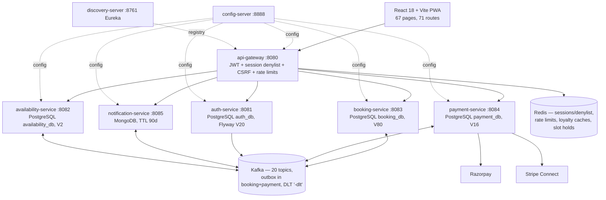

# 01 — System Overview (Current)

> Audit run AUD-2026-07-25-01 · commit `6440f58` · static analysis only

## What this is

SK Binge Galaxy is a multi-tenant private venue & event booking platform ("Binges" are venues/tenants). A React 18 PWA fronts a Spring Cloud microservice backend. Customers browse venues, hold slots, book rooms/events with add-ons, pay via Razorpay or Stripe (or a simulation gateway in dev), earn/redeem loyalty points, check in via QR/OTP, and can transfer bookings via magic link. Binge admins run their venue (pricing, rooms, waitlists, risk, support); super admins govern the platform (approvals, currencies, loyalty programs, CMS, authority delegation).

## Runtime shape (VERIFIED-STATIC)

`common-lib` is a shared compile-time JAR (enums, Kafka topic constants, money helpers, internal-auth filter), not a runtime service.

## Verified census (commit 6440f58)

| Metric | Count | Method |
|---|---:|---|
| Tracked files | 1,423 | `git ls-files` |
| Java source files | 712 | glob count |
| Frontend JSX files | 153 | glob count |
| SQL files | 119 | glob (incl. 118 Flyway migrations + infra/init-databases.sql) |
| Markdown docs | 109 | glob count |
| REST controllers | 47 | `*Controller.java` in `src/main` |
| Mapping annotations | 477 | `@GetMapping` etc. grep |
| Endpoint rows (generated) | 429 | [evidence/endpoint-inventory-current.tsv](evidence/endpoint-inventory-current.tsv) |
| JPA entities + Mongo documents | 93 | `@Entity`/`@Document` grep |
| Spring Data repositories | 93 | interface grep |
| Frontend routes | 71 | [evidence/frontend-routes-current.tsv](evidence/frontend-routes-current.tsv) |
| Frontend static API call sites | 372 | [evidence/frontend-api-pairs-current.tsv](evidence/frontend-api-pairs-current.tsv) |
| Backend test files | 80 | `src/test` glob |
| Frontend test files | 42 + 7 Playwright specs | glob |
| `@Scheduled` jobs | 33 | grep |
| `@KafkaListener`s | 16 | grep |
| Kafka topics (constants) | 20 | `KafkaTopics.java` |
| Compose services | 23 | docker-compose.yml |
| Dockerfiles | 11 | glob |
| k8s manifests | 23 | k8s/ glob |

Flyway heads: **auth V20, availability V2, booking V80, payment V16.** (Root README's "V19/V77/V14" and "70 routes/421 mappings" are stale — recorded in [22-DOCUMENTATION-CONTRADICTION-REGISTER.md](22-DOCUMENTATION-CONTRADICTION-REGISTER.md).)

## Technology

| Layer | Verified versions |
|---|---|
| Backend | Java 17, Spring Boot 3.4.5, Spring Cloud 2024.0.1, Maven multi-module (9 modules) |
| Frontend | React 18.3, Vite 5, React Router, Zustand + Context, Axios, vite-plugin-pwa (autoUpdate, NetworkOnly for `/api`) |
| Data | PostgreSQL 16 (4 DBs), MongoDB 7 (notifications), Redis |
| Messaging | Kafka (ZooKeeper in base compose; KRaft overlay `docker-compose.kraft.yml`; RF=3 in k8s) |
| Payments | Razorpay (orders/callbacks/refunds/disputes), Stripe Connect (onboarding/webhooks/refunds), simulation gateway with `@PostConstruct` production fail-fast |
| Deploy | Docker Compose (dev), Kubernetes + Argo Rollouts canary + HPA + PDB + NetworkPolicy + External Secrets/Vault, Jenkins pipeline |
| Observability | Actuator, Prometheus ServiceMonitor, Zipkin/Brave, Loki; **no PrometheusRule alert manifests** |

## Trust boundary (VERIFIED-STATIC)

Only the frontend and gateway are public entry points. The gateway validates JWT + Redis session denylist, strips inbound spoofable identity headers, injects trusted `X-User-Id`/`X-User-Role`/`X-User-Email` headers, and enforces CSRF and rate limits. Downstream services re-check role, Binge scope (`requireManagedBinge`), and object ownership. Internal service-to-service endpoints use a shared secret (`INTERNAL_API_SECRET`) via a common-lib filter. Provider webhooks (Razorpay/Stripe) are HMAC-verified with idempotent dedup.

## State of the tree

- Working tree at baseline: **clean** (0 porcelain entries) — the July-23 finding "599 uncommitted files" (P0-1) is **resolved**; the tree was committed as `3d65090` and merged as `6440f58`.
- Workspace anomaly (outside repo): the parent folder `d:\sk-binge-galaxy` contains an empty broken `.git` and an empty `sk-binge-galaxy;C` folder. The true repo root is `d:\sk-binge-galaxy\sk-binge-galaxy`. See [02-REPOSITORY-INVENTORY.md](02-REPOSITORY-INVENTORY.md).

## Verdict pointer

The overall production verdict, blockers, and strengths live in [EXECUTIVE-SUMMARY-CURRENT.md](EXECUTIVE-SUMMARY-CURRENT.md). Issues live only in [ISSUE-REGISTER-CURRENT.md](ISSUE-REGISTER-CURRENT.md).
