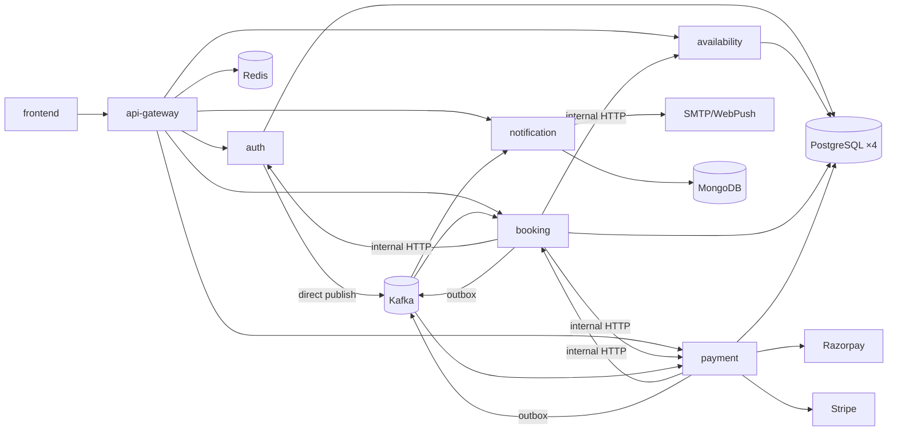

# 05 — Service Dependency Map (Current)

> Audit run AUD-2026-07-25-01 · commit `6440f58` · VERIFIED-STATIC

## Synchronous edges (HTTP)

| From | To | Purpose | Auth |
|---|---|---|---|
| frontend | api-gateway | All API traffic (`/api/v1`, `/api/v2/loyalty`) | httpOnly cookies (access+refresh), CSRF token |
| api-gateway | all 5 domain services | Routing after JWT+denylist validation; injects `X-User-Id/Role/Email` | Trusted-header model |
| booking-service | auth-service | User lookups, authority-lock checks | `INTERNAL_API_SECRET` header (common-lib filter) |
| booking-service | availability-service | Slot availability validation | internal secret |
| booking-service | payment-service | Refund intents, payment status | internal secret |
| payment-service | booking-service | Booking state confirmation | internal secret |
| payment-service | Razorpay / Stripe | Orders, refunds, Connect onboarding | Provider keys (env-injected) |
| notification-service | SMTP / WebPush / webhook targets | Delivery | Provider credentials |
| all services | config-server | Boot-time config | Basic auth (`CONFIG_SERVER_PASSWORD`) |
| all services | discovery-server | Registration/lookup | Basic auth (`EUREKA_PASSWORD`) |

## Asynchronous edges (Kafka) — summary

Producers → topics → consumers (full matrix with file:line in [evidence/producer-consumer-matrix.tsv](evidence/producer-consumer-matrix.tsv)):

| Topic | Producer | In-repo consumers |
|---|---|---|
| booking.created | booking (outbox) | payment, notification, booking loyalty EarnEngine |
| booking.cancelled | booking (outbox) | payment (refund saga), notification, booking (waitlist promotion) |
| booking.confirmed / rescheduled / transferred / checked-in / completed | booking | **none in repo** (notification consumes some lifecycle via templates — verify at runtime) |
| payment.success / payment.failed | payment (outbox) | booking (state machine), notification |
| refund.* | payment | booking, notification |
| user.registered | auth | **none in repo** |
| user.anonymized | auth ([UserAnonymizationService.java:159](../../backend/auth-service/src/main/java/com/skbingegalaxy/auth/service/UserAnonymizationService.java)) | booking, payment, notification (`UserAnonymizedEventListener` in each) |
| password.reset | auth | **none in repo** |
| room.approved / room.rejected | booking | **none in repo** |
| waitlist.promoted | booking | notification |
| loyalty internal topics | booking | booking (internal engines) |

16 `@KafkaListener`s total; all consumer groups use DLT (`-dlt`) with retry policy; consumers dedupe via ProcessedEvent.

## Startup order (compose)

postgres/mongo/redis/zookeeper+kafka → init jobs (`init-databases`, `kafka-init` topics) → discovery → config → gateway + domain services (healthcheck-gated `depends_on`) → frontend (nginx).

## Failure-mode notes

- Config/discovery are single points at boot (restart-safe; services cache config).
- Outbox relay ensures no event loss if Kafka is down (booking/payment); **auth-service publishes directly** — `user.anonymized` emission during a Kafka outage relies on retry, not an outbox (register EVT-02).
- No consumer for `booking.confirmed` etc. means downstream projections (if any external) are aspirational; verify before contract commitments.

## Diagram

